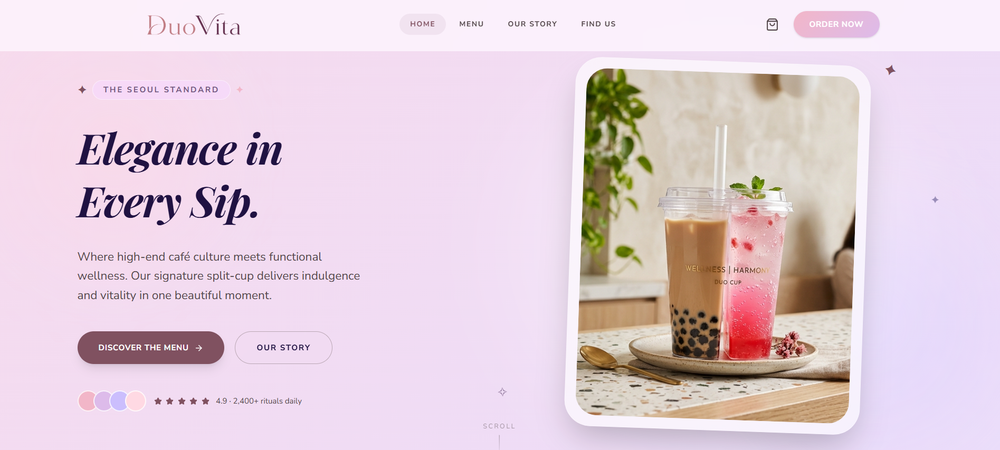
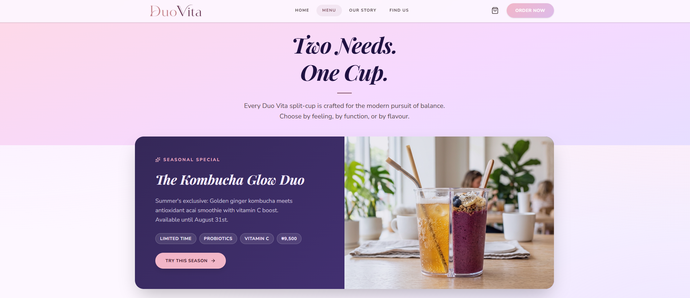
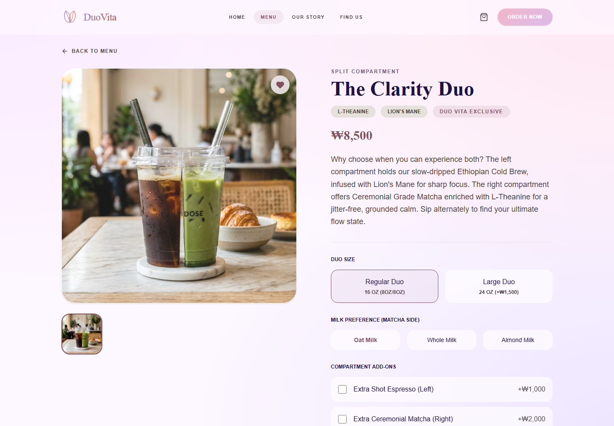
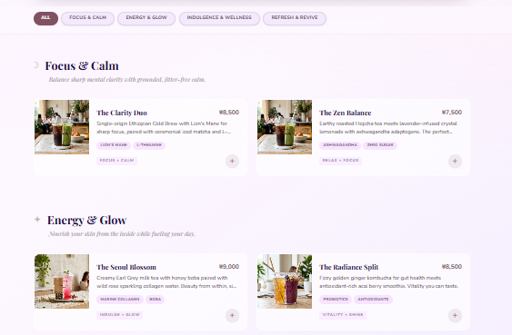
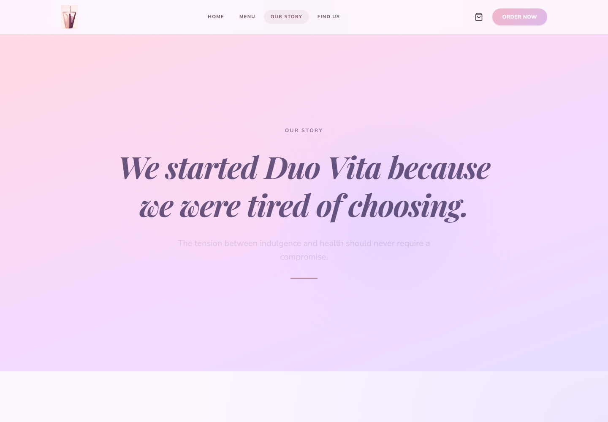

# Duo Vita

<p align="center">
  <strong>A premium functional wellness cafe storefront for Seoul's modern beverage ritual.</strong>
</p>

<p align="center">
  
  
  
  
</p>

<p align="center">
  
</p>

## Overview

Duo Vita is a polished React storefront for a fictional wellness cafe brand built around split-cup beverages: one side indulgent, one side functional. The site combines editorial brand storytelling with practical ecommerce flows, including a categorized menu, configurable product detail page, cart drawer, location finder, and event tracking hooks.

The visual system is intentionally premium: soft glass panels, pastel gradients, Playfair Display headlines, refined product photography, and motion-driven interactions.

## Screenshots

<table>
  <tr>
    <td width="50%">
      
      <br>
      <sub><strong>Menu:</strong> seasonal feature, category filters, and product cards.</sub>
    </td>
    <td width="50%">
      
      <br>
      <sub><strong>Product:</strong> configurable drink detail page with cart-ready options.</sub>
    </td>
  </tr>
  <tr>
    <td width="50%">
      
      <br>
      <sub><strong>Responsive:</strong> mobile navigation and stacked home hero.</sub>
    </td>
    <td width="50%">
      
      <br>
      <sub><strong>Story:</strong> editorial brand narrative and positioning page.</sub>
    </td>
  </tr>
</table>

## Features

- Premium landing page with animated hero, brand promise, featured drinks, persona messaging, and newsletter CTA.
- Menu experience with category filters, seasonal feature, quick-add actions, and product routing.
- Product detail page with size selection, milk options, add-ons, dynamic pricing, accordions, and add-to-cart behavior.
- Cart drawer with item options, totals, removal, simulated checkout, and success state.
- Story page with founder narrative, brand pillars, customer persona, and positioning statement.
- Find Us page with Seoul locations, order-ahead actions, and a stylized map panel.
- Serverless tracking endpoints for menu clicks and richer user events through Neon.

## Tech Stack

- **Frontend:** React 19, TypeScript, React Router
- **Styling:** Tailwind CSS 4, custom theme tokens, Google Fonts
- **Animation:** Motion for React
- **Icons:** Lucide React
- **Build Tool:** Vite
- **Analytics and API:** Vercel Analytics, serverless API routes, Neon serverless database client

## Getting Started

```bash
npm install
npm run dev
```

The development server runs on:

```text
http://localhost:3000
```

## Available Scripts

```bash
npm run dev      # Start the local Vite dev server
npm run build    # Create a production build in dist/
npm run preview  # Preview the production build locally
npm run lint     # Run TypeScript checks
```

## Environment

The frontend can run without secrets. The serverless tracking endpoints need a Neon connection string when deployed:

```env
DATABASE_URL="postgresql://..."
APP_URL="https://your-deployment-url.com"
GEMINI_API_KEY="optional-if-used-by-hosting-environment"
```

The API routes currently write to:

- `user_events` through `api/track-event.js`
- `menu_clicks` through `api/track-click.js`

## Project Structure

```text
api/
  track-click.js
  track-event.js
src/
  assets/images/       Product and editorial imagery
  components/          Layout, navigation, logo, cart drawer
  context/             Cart state provider
  pages/               Home, menu, product, story, locations, text pages
  utils/               Event tracking helper
docs/screenshots/      README screenshots captured from the live app
```

## Deployment Notes

This app builds as a static Vite frontend with optional serverless API routes. It is a natural fit for Vercel because the `api/` folder maps directly to serverless functions. For other hosts, serve `dist/` as the frontend and wire the API routes to a Node-compatible serverless runtime.

Before shipping, run:

```bash
npm run lint
npm run build
```
